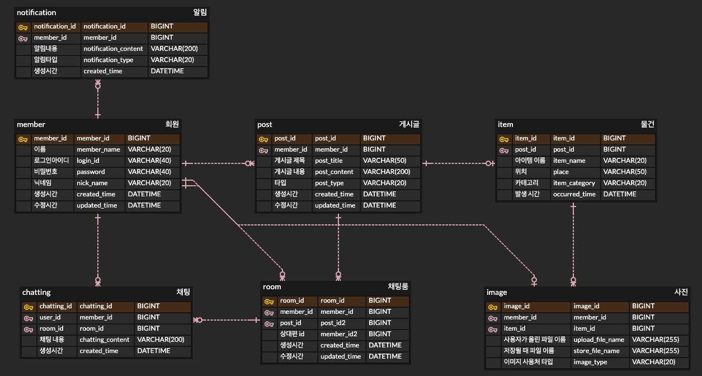

# 🌲 분실물 찾기 서비스 (LostAndFoundService)


## 📌 사이트 주소
https://www.wanna-find.com/


## 📖 개요
  - 1인 개발
  - 개발 기간 : 23.11.01 ~
  - 잃어버린 물건의 주인을 찾아주는 게시판 형태의 **분실물 서비스** 입니다.
  - AWS(EC2, RDS, S3)환경으로 배포한 상태입니다.

## 🛠 개발 환경
- JAVA : 17
- Spring Boot : 3.1.5
- JPA
- MySQL
- Thymeleaf

## 🧭 아키텍처


## 💎 Main Features
- 게시판 CRUD
  - S3에 이미지 저장
  - AOP 사용해 16개 method 코드 중복 제거
- Session 방식 로그인
  - Spring Interceptor를 활용해 비로그인 시 페이지 접근 제한
- 검색 기능
  - 게시물 타입, 내용에 대한 검색 기능 구현
- 1:1 채팅 기능
  - WebSocket을 활용한 실시간 채팅 기능 구현
- 관리자 페이지
  - 사용자, 게시물, 채팅방 삭제 및 사용자 권한 변경 

## 💾 ERD


## 🎯 트러블 슈팅
### 목차

1. [운영환경에서 WebSocket 이용한 Chatting 안되는 문제](#1-운영환경에서-websocket-이용한-chatting-안되는-문제)
2. [AOP를 사용해, 16개 method 중복 코드 제거](#2-aop를-사용해-16개-method-중복-코드-제거)
3. [맴버 삭제 불가능 문제](#3-맴버-삭제-불가능-문제)

--- 

## 1. 운영환경에서 WebSocket 이용한 Chatting 안되는 문제
### 문제
* WebSocket을 이용한 실시간 1:1 채팅 기능이 로컬에선 정상작동되지만, 운영환경에선 동작하지 않음.

### 해결

#### 1. WebSocket 생성자 url 변경

- ```js
  // chattingJSScript.html
  let socket = new WebSocket("ws://" + [[${url}]] + "/ws");
  ```
- ```yaml
  # application-prod.yml
  websocket:
  url: wanna-find.com
  ```
- ```yaml
  # application-local.yml
  websocket:
  url: localhost:8080
  ```

<br>

#### 2. Nginx 리버스 프록시 설정

* WebSocket은 hop-by-hop 프로토콜이기 때문에, Nginx에서 적절한 헤더를 추가해주어야 했음.
* WebSocket 핸드셰이크는 HTTP 업그레이드 기능을 사용해 호환할 수 있다.
* ```
  //nginx.conf
  server {
          server_name wanna-find.com www.wanna-find.com; # managed by Certbot
          ...

          location /ws {
                  proxy_pass http://localhost:8080/ws;
                  proxy_http_version 1.1;
                  proxy_set_header Upgrade $http_upgrade;
                  proxy_set_header Connection "Upgrade";
                  proxy_set_header Host $host;
                  ...
          }
          ...
  }
  ```
* HTTP 버전은 1.1이상 이어야 하며, `Upgrade header`와 `Connection header`를 명시해주어 수신하는 웹서버가 해당 요청이 WebSocket 요청임을 알 수 있게한다.

<br>

#### 3. Mixed Content 문제 해결
- 아래와 같은 추가적인 문제 발생
- ```
  Mixed Content: The page at 'xxx' was loaded over HTTPS, ..
  ```
- HTTPS 사이트에서 HTTP 사이트 요청 시 발생하는 보안 문제
- WebSocket 생성시 `wss`가 아닌 `ws`여서 발생한 문제같다.
- header에 아래 코드 추가해서 해결
- ```html
  <meta http-equiv="Content-Security-Policy" content="upgrade-insecure-requests">
  ```

---

## 2. AOP를 사용해, 16개 method 중복 코드 제거
### 문제
* Controller에서 로그인 유저 객체를 사용하는 상황  

### 해결
* AOP를 사용해 Session에 저장된 loginUser 객체를 model에 전달
* 포인트컷을 통해 AOP 적용 범위를 제한
* 결과적으로, 총 16개 method의 중복 코드를 제거  

---


## 3. 맴버 삭제 불가능 문제
### 문제
  - Member 객체 삭제시 error 발생
  - ```
    Cannot delete or update a parent row: a foreign key constraint fails cascade
    ```
### 시도
  - 다른 테이블에 해당 데이터를 참조하고 있는 외래키가 있어서 발생했다고 판단
  - 연관관계의 부모에 `cascade = CascadeType.ALL, orphanRemoval = true`을 모두 추가
  - 결국 실패
### 해결
  - JPQL로 쿼리를 날려서 delete한 것이 원인이었다. 그러면, cascade가 적용안된다.
  - `em.remove`를 통해 삭제해줘서 해결
---


