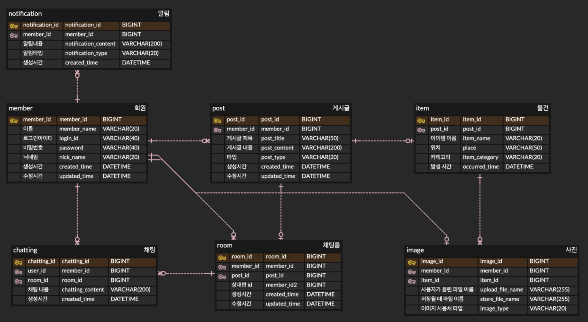

# 🌲 분실물 찾기 서비스 (LostAndFoundService)


## 📌 사이트 주소
https://www.wanna-find.com/


## 📖 개요
  - 1인 개발
  - 개발 기간 : 23.11.01 ~
  - 잃어버린 물건의 주인을 찾아주는 게시판 형태의 **분실물 서비스** 입니다.
  - AWS(EC2, RDS, S3)환경으로 배포한 상태입니다.

## 🛠 개발 환경
- JAVA : 17
- Spring Boot : 3.1.5
- JPA
- MySQL
- Thymeleaf

## 🧭 아키텍처


## 💎 Main Features
- 기본적인 게시판 CRUD
  - S3에 이미지 저장
- Session 방식 로그인
  - Spring Interceptor를 활용해 비로그인 시 페이지 접근 제한
- 검색 기능
  - 게시물 타입, 내용에 대한 검색 기능 구현
- 1:1 채팅 기능
  - WebSocket을 활용한 실시간 채팅 기능 구현
- AOP 
  - 16개 method 코드 중복 제거
- Nginx를 이용한 리버스 프록시

## 💾 ERD


## 🎯 트러블 슈팅
### 목차

1. [운영환경에서 WebSocket 이용한 Chatting 안되는 문제](#1-운영환경에서-websocket-이용한-chatting-안되는-문제)
2. [AOP를 사용해, 16개 method 중복 코드 제거](#2-aop를-사용해-16개-method-중복-코드-제거)
3. [H2 user 키워드 예약어 문제](#3-h2-user-키워드-예약어-문제)

--- 

### 1. 운영환경에서 WebSocket 이용한 Chatting 안되는 문제
#### 문제
* WebSocket을 이용한 실시간 1:1 채팅 기능이 로컬에선 정상작동되지만, 운영환경에선 동작하지 않음.

#### 해결
* WebSocket은 hop-by-hop 프로토콜이기 때문에, Nginx에서 적절한 헤더를 추가해주어야 했음.
* WebSocket 핸드셰이크는 HTTP 업그레이드 기능을 사용해 호환할 수 있다.
* ```
  //nginx.conf
  server {
          server_name wanna-find.com www.wanna-find.com; # managed by Certbot
          ...

          location /ws {
                  proxy_pass http://localhost:8080/ws;
                  proxy_http_version 1.1;
                  proxy_set_header Upgrade $http_upgrade;
                  proxy_set_header Connection "Upgrade";
                  proxy_set_header Host $host;
                  ...
          }
          ...
  }
  ```
* HTTP 버전은 1.1이상 이어야 하며, `Upgrade header`와 `Connection header`를 명시해주어 수신하는 웹서버가 해당 요청이 WebSocket 요청임을 알 수 있게한다.

---

### 2. AOP를 사용해, 16개 method 중복 코드 제거
#### 문제
* Controller method들에서 parameter로 로그인 유저 객체를 사용하는 상황  

#### 해결
* 중복 코드를 줄이고자, AOP를 사용해 Session에서 받아온, loginUser 객체를 model에 넣어줌.
* 포인트컷을 통해 AOP 적용되는 범위를 제한
* 결과적으로, 총 16개 method의 중복 코드를 제거  

---


### 3. H2 user 키워드 예약어 문제
#### 문제
* 테스트용 db로 H2를 사용하면서, 문제가 발생.  
* Message: `Caused by: org.h2.jdbc.JdbcSQLSyntaxErrorException: Syntax error in SQL statement "insert into [*]user..`  

#### 해결
* H2 db 2.1.214 버전에서 user 키워드가 예약어로 지정되어 있어서 발생한 문제
* `User` Entitiy에 `@Table(name = "users")` 추가해서 임시 해결 
* 계속 문제가 생길 것 같아, `User` -> `Member`로 이름변경을 해줌.
---


