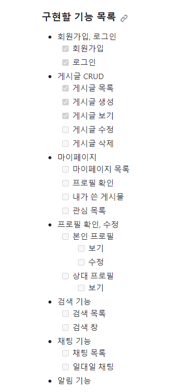
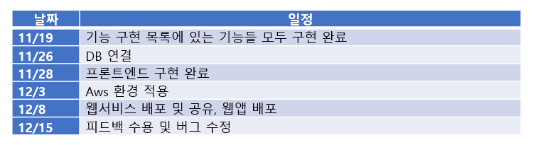

# LostAndFoundService

- 1인 개발
- 개발 기간 : 23.11.01 ~

## 📖 개요
  - 잃어버린 물건이나, 찾은 물건을 게시글로 올려 주인을 찾아주는 **분실물 서비스** 입니다.
  - TDD, OOP, Clean Code를 지향하며 개발 중 입니다.

## 🛠 개발 환경
- JAVA : 17
- Spring Boot : 3.1.5
- Thymeleaf

## 📃 IA

## 💾 ERD

## 🎯 진행 상황

- 구현된 기능
  - 회원가입, 로그인
  - 게시글 CRUD
    - 게시글 목록 보기, 게시글 생성, 게시글 보기

## 💎 기능 소개
### 1. 회원가입, 로그인
- Interceptor 활용한 로그인 여부 체크 기능
  - 로그인 시 Session에 유저 객체가 담기기 때문에, LoginCheckInterceptor에서 Session을 확인해 로그인 여부를 체크
  - 비로그인 시, 로그인 화면으로 redirect
  - WebConfig에서 interceptor 추가 및 비로그인 상태에서 볼 수 있는 view 관리
- ArgumentResolver 활용한 로그인 회원 정보 조회
  - @Login 커스텀 어노테이션으로 로그인 회원 정보 조회 가능
  - @SessionAttribute 대신 커스텀 어노테이션으로 더 깔끔하고 편하게 사용 가능

## 📆 추후 계획
