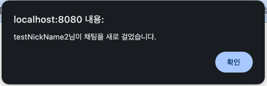

# 🌲 분실물 찾기 서비스 (LostAndFoundService)

## 📌 사이트 주소
http://ec2-13-125-3-8.ap-northeast-2.compute.amazonaws.com:8080/

준비되면, 새 도메인 연결할 예정

## 📖 개요
  - 1인 개발
  - 개발 기간 : 23.11.01 ~
  - 잃어버린 물건의 주인을 찾아주는 게시판 형태의 **분실물 서비스** 입니다.

## 🛠 개발 환경
- JAVA : 17
- Spring Boot : 3.1.5
- JPA
- MySQL
- Thymeleaf

## 💎 Main Features
- 기본적인 게시판 CRUD
  - 게시글 CRUD
  - S3에 이미지 저장
- 비로그인 시 페이지 접근 제한
  - Interceptor를 활용한 로그인 여부 체크 및 페이지 접근 제한
- 검색 기능
  - 게시물 타입, 내용에 대한 검색 기능 구현
  - JPQL을 사용해 동적 쿼리 작성
- 1:1 채팅 기능
  - WebSocket을 활용한 실시간 채팅 기능 구현
- 알림 기능
  - SSE을 활용한 실시간 알림 기능 구현
- AOP
  - 많은 Controller method에서 parameter로 로그인 유저 객체를 받아오는 상황
  - AOP를 사용해, 16개 method 중복 코드 제거
- 테스트 코드
  - JUnit5를 활용하여 단위/통합 테스트 작성
  - 테스트용 H2 db 분리

## 💾 ERD

## 🎯 문제 해결
### 목차

1. [WebSocket 1:1 채팅 기능](#1-websocket-11-채팅-기능)
2. [SSE 알림 기능](#2-sse-알림-기능)
3. [AOP를 사용해, 16개 method 중복 코드 제거](#3-aop를-사용해-16개-method-중복-코드-제거)
4. [H2 user 키워드 예약어 문제](#4-h2-user-키워드-예약어-문제)
5. [비로그인 시 페이지 접근 제한](#5-비로그인-시-페이지-접근-제한)
6. [검색 기능](#6-검색-기능)

---
### 1. WebSocket 1:1 채팅 기능
#### 문제
* 게시물의 게시자와 실시간 1:1 채팅할 수 있는 기능이 필요했습니다.  

#### 해결
* '실시간'이 핵심이기 때문에, WebSocket 통신을 사용하기로 했고, 관련 Config와 Handler를 추가했습니다.  
[WebSocketConfig](https://github.com/yohanii/LostAndFoundService/blob/main/src/main/java/com/yohanii/lostandfound/service/chat/WebSocketChatHandler.java)  
[WebSocketChatHandler](https://github.com/yohanii/LostAndFoundService/blob/main/src/main/java/com/yohanii/lostandfound/WebSocketConfig.java)
---

### 2. SSE 알림 기능
#### 문제
* 로그인 상태일 때, 누군가 새로 채팅을 걸면 실시간 알림이 오는 기능이 필요했습니다.  

#### 해결
* WebSocket는 자원 낭비이고, 서버에서 클라이언트로만 응답을 보낼 수 있는 SSE를 사용하기로 했습니다.  
* SseEmitter는 EmitterRepository의 ConcurrentHashMap에 저장을 해줍니다.  
* 관련 Controller, Service, Repository를 추가했습니다.  
[EmitterRepository](https://github.com/yohanii/LostAndFoundService/blob/main/src/main/java/com/yohanii/lostandfound/domain/notify/EmitterRepository.java)  
[NotificationService](https://github.com/yohanii/LostAndFoundService/blob/main/src/main/java/com/yohanii/lostandfound/service/notify/NotificationService.java)  
[NotificationController](https://github.com/yohanii/LostAndFoundService/blob/main/src/main/java/com/yohanii/lostandfound/web/notify/NotificationController.java)  
---

### 3. AOP를 사용해, 16개 method 중복 코드 제거
#### 문제
* Nav에서 loginUser에 대한 data가 필요해,  
* 많은 Controller method에서 parameter로 loginUser 객체를 받아오는 상황이었습니다.  

#### 해결
* 중복 코드를 줄이고자, AOP를 사용하기로 했습니다.  
* AOP에서 Session에서 받아온, loginUser 객체를 model에 넣어주었고,   
* 포인트컷을 통해 AOP 적용되는 범위를 제한했습니다.  
* 결과적으로, 총 16개 method의 중복 코드를 제거했습니다.  
[LoginMemberAOP](https://github.com/yohanii/LostAndFoundService/blob/main/src/main/java/com/yohanii/lostandfound/aop/LoginMemberAOP.java)
---

### 4. H2 user 키워드 예약어 문제
#### 문제
* 테스트용 db로 H2를 사용하면서, 문제가 발생했습니다.  
* Message: `Caused by: org.h2.jdbc.JdbcSQLSyntaxErrorException: Syntax error in SQL statement "insert into [*]user..`  

#### 해결
* H2 db 2.1.214 버전에서 user 키워드가 예약어로 지정되어 있어서 발생한 문제였고,  
* `User` Entitiy에 `@Table(name = "users")` 써줘서 해결했고,  
* 계속 문제가 생길 것 같아, `User` -> `Member`로 이름변경을 해줬습니다.
---

### 5. 비로그인 시 페이지 접근 제한
#### 문제
* 로그인, 비로그인 상태에 따라, 접근할 수 있는 페이지를 구분해야했습니다.

#### 해결
* Interceptor를 이용해, 요청을 받아들이기 전에, 로그인 상태인지 검증하기로 했습니다.  
* 비로그인 상태라면, 로그인 form으로 redirect 시켜주었습니다.  
* WebConfig에서 인터셉터 추가 및 접근 가능 페이지를 관리해주었습니다.  
[LoginCheckInterceptor](https://github.com/yohanii/LostAndFoundService/blob/main/src/main/java/com/yohanii/lostandfound/web/interceptor/LoginCheckInterceptor.java)  
[WebConfig](https://github.com/yohanii/LostAndFoundService/blob/main/src/main/java/com/yohanii/lostandfound/WebConfig.java)
---

### 6. 검색 기능
#### 문제
* 게시글 검색에 타입, 내용이 사용되어서, 동적 쿼리 작성이 필요했습니다.

#### 해결
* JPQL을 이용해 직접 동적 쿼리를 작성했습니다.  
* 추후에 QueryDSL로 수정할 예정입니다.  
[postRepository](https://github.com/yohanii/LostAndFoundService/blob/main/src/main/java/com/yohanii/lostandfound/domain/post/PostRepository.java)  

---

## 📷 결과 화면
- Home & loginHome  
  
  

- 로그인 & 회원가입  
  
  

- 알림 & 알림목록  
  
  
  

- 1:1 채팅 & 채팅 목록  
  
  

- 검색  
  

- 게시글 CRUD  
  
  
  
  
  

- 마이페이지
  - 프로필  
    
  - 내가 쓴 게시물  
    

